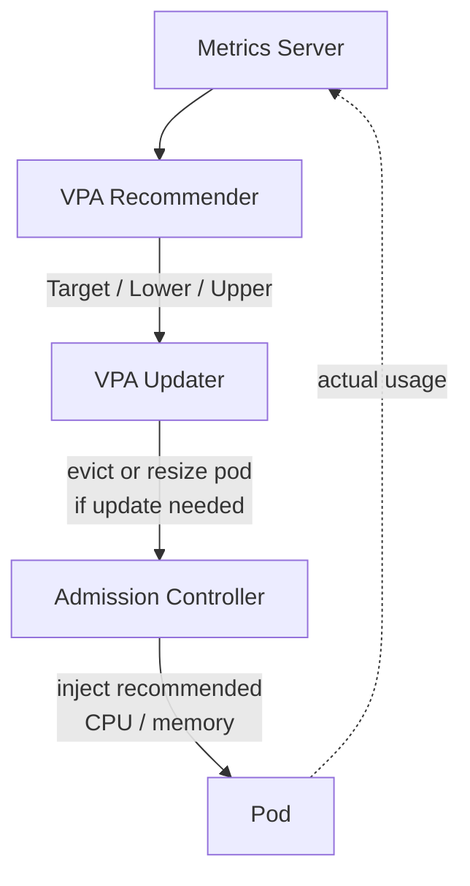

# Kubernetes Vertical Pod Autoscaler (VPA) Demo

A hands-on, single-node demo of the **Vertical Pod Autoscaler**. You deploy a
deliberately under-provisioned pod, watch VPA calculate resource
recommendations from real usage, then let VPA apply them.

> **One sentence:** HPA changes *how many* pods you have, VPA changes *how big*
> each pod is, and the Cluster Autoscaler changes *how many nodes* exist.

---

## Contents

| File | Purpose |
|------|---------|
| `01-deployment.yaml` | A busybox pod that burns CPU so VPA has usage to observe |
| `02-vpa-off.yaml` | VPA in **Off** mode — recommend only, never touch the pod |
| `03-vpa-on.yaml` | VPA in **Recreate** mode — actually apply recommendations |
| `watch.sh` / `watch.ps1` | Print pod requests next to the VPA recommendation |

---

## How VPA works

VPA is **not** part of core Kubernetes — you install it separately (see below).
It runs three cooperating controllers:



| Component | Job |
|-----------|-----|
| **Recommender** | Watches actual usage and computes Target / Lower Bound / Upper Bound |
| **Updater** | Decides whether a running pod needs updating and evicts/resizes it |
| **Admission Controller** | Mutating webhook that injects recommended values into new pods |

---

## Prerequisites

You need a running cluster and a **working Metrics Server** (VPA reads usage
from it):

```bash
kubectl get nodes          # a Ready node
kubectl top nodes          # must return numbers, not an error
kubectl top pods -A        # must return numbers, not an error
```

If `kubectl top` errors, fix Metrics Server before continuing — VPA can do
nothing without it.

### Install VPA (if not already present)

```bash
cd /tmp
git clone https://github.com/kubernetes/autoscaler.git
cd /tmp/autoscaler/vertical-pod-autoscaler
./hack/vpa-up.sh
```

Verify the components and CRD:

```bash
kubectl get pods -n kube-system | grep vpa      # recommender / updater / admission-controller
kubectl get crd | grep verticalpod
kubectl api-resources | grep -i vertical
```

---

## Walkthrough

### 1. Deploy the workload

```bash
kubectl apply -f 01-deployment.yaml
kubectl get deployment vpa-demo
kubectl get pods -l app=vpa-demo
kubectl top pods            # note the actual CPU/memory usage
```

The pod starts with an intentionally small request: **CPU 50m, memory 32Mi**.

### 2. Turn VPA on in Off mode (observe only)

```bash
kubectl apply -f 02-vpa-off.yaml
```

**Off** means VPA calculates a recommendation but **does not change the running
pod**. This is the safe way to preview what VPA would do.

### 3. Wait, then read the recommendation

VPA needs a few minutes of usage history. While the app runs:

```bash
kubectl get vpa
kubectl describe vpa vpa-demo          # human-readable
kubectl get vpa vpa-demo -o yaml       # full status.recommendation

# convenience: pod requests vs. VPA target, side by side
./watch.sh                              # or  .\watch.ps1  on Windows
```

Look under `status.recommendation.containerRecommendations` for:

```
Target:        preferred value      e.g. CPU 200m / memory 64Mi
Lower Bound:   floor of the range   e.g. CPU 100m
Upper Bound:   ceiling of the range e.g. CPU 300m
```

```
Lower          Target          Upper
  |              |               |
100m           200m            300m
```

The key comparison is **current pod request (50m / 32Mi)** vs. **VPA Target**.

### 4. Turn VPA on for real (Recreate mode)

Swap the Off config for the On config:

```bash
kubectl delete -f 02-vpa-off.yaml
kubectl apply  -f 03-vpa-on.yaml
```

`03-vpa-on.yaml` uses `updateMode: "Recreate"`, so VPA may evict the pod; the
Deployment creates a replacement; and the admission controller injects the
recommended requests into it.

### 5. Watch the pod get replaced

```bash
kubectl get pods -l app=vpa-demo -w
```

```
Old Pod  ->  Terminating  ->  New Pod  ->  Running
```

### 6. Confirm the new requests

```bash
kubectl get pods -l app=vpa-demo         # get the new pod name
kubectl get pod <POD-NAME> -o yaml       # look under resources.requests
./watch.sh
```

| | CPU request | Memory request |
|--|--|--|
| **Before VPA** | 50m | 32Mi |
| **After VPA** | e.g. 200m | e.g. 64Mi |

Exact numbers depend on observed usage, clamped to the `minAllowed` /
`maxAllowed` range in the manifest.

### Watch everything at once (great for teaching)

| Terminal | Command |
|----------|---------|
| 1 | `kubectl top pods` |
| 2 | `kubectl get pods -l app=vpa-demo -w` |
| 3 | `kubectl get vpa vpa-demo -o yaml` |
| 4 | `kubectl describe vpa vpa-demo` |

---

## The key concept

VPA does **not** add pods. It keeps the same pod count and makes each pod
bigger — this is **vertical** scaling.

```
Before:  Deployment -> 1 Pod (50m / 32Mi)
After:   Deployment -> 1 Pod (200m / 64Mi)   # still 1 pod, just bigger
```

---

## Update modes

| Mode | What it does | Restarts the pod? |
|------|--------------|-------------------|
| `Off` | Recommend only; never applies | No |
| `Initial` | Applies recommendations only when a pod is created | Only on natural restarts |
| `Recreate` | Evicts the pod when the recommendation drifts; replacement gets new values | Yes |
| `InPlaceOrRecreate` | Resizes the running pod in place; falls back to eviction if it can't | Sometimes |
| `InPlace` | Resizes in place only; **never** evicts — waits and retries instead | No |
| `Auto` | **Deprecated** since VPA 1.4.0; now an alias for `Recreate` | Yes |

**In-place resize** (the `InPlace*` modes) reached GA in **Kubernetes 1.35
(December 2025)** and requires **VPA 1.4+**. It patches CPU/memory on the
running pod via the `/resize` subresource, so no restart is needed. To try it,
change `updateMode` in `03-vpa-on.yaml` to `"InPlaceOrRecreate"`.

> ⚠️ Decreasing a **memory** limit in place can trigger an OOM kill if current
> usage is above the new limit; the kubelet guards against this but be careful.

---

## Resource policy in this demo

```yaml
minAllowed: { cpu: 50m,  memory: 32Mi }   # VPA won't recommend below this
maxAllowed: { cpu: 400m, memory: 256Mi }  # VPA won't recommend above this
controlledResources: [cpu, memory]
```

---

## Gotchas (read these — they cause most "it didn't work" reports)

- **Recreate mode does nothing with too few replicas.** The updater refuses to
  evict if that would drop running replicas below its `--min-replicas` flag
  (default **2**). This demo uses **1 replica** plus `updatePolicy.minReplicas: 1`
  in `03-vpa-on.yaml` so eviction is allowed. If you bump replicas up, keep this
  in mind.
- **Give it time.** The recommender needs several minutes of history before
  `status.recommendation` is populated.
- **Metrics Server must work.** No `kubectl top` numbers ⇒ no recommendations.
- **Don't point HPA and VPA at the same CPU/memory metric** — they will fight.
  (VPA on requests + HPA on a custom metric is fine.)
- **Single-node capacity limit.** If VPA recommends more than the node can
  offer, the new pod stays **Pending**. VPA never adds nodes — that's the
  Cluster Autoscaler's job.

---

## HPA vs. VPA vs. Cluster Autoscaler

| Autoscaler | Changes | Example |
|------------|---------|---------|
| **HPA** | Number of pods | 2 pods → 5 pods |
| **VPA** | Resources per pod | CPU 100m → 300m |
| **Cluster Autoscaler** | Number of nodes | 1 node → 2 nodes |

---

## Production note

`Recreate` restarts pods, which means brief downtime for single-replica
workloads. For production, prefer `InPlaceOrRecreate` (or `InPlace`) on a
supported cluster to right-size without restarts, keep a sensible `minReplicas`,
and respect Pod Disruption Budgets.

---

## Cleanup

```bash
kubectl delete -f 03-vpa-on.yaml
kubectl delete -f 01-deployment.yaml
kubectl get pods

# to remove VPA itself:
cd /tmp/autoscaler/vertical-pod-autoscaler
./hack/vpa-down.sh
```

---

## Command reference

```bash
kubectl get vpa                       # list VPAs
kubectl describe vpa vpa-demo         # readable recommendation
kubectl get vpa vpa-demo -o yaml      # full status
kubectl get pods -l app=vpa-demo      # pods
kubectl get pods -l app=vpa-demo -w   # watch pods
kubectl top pods                      # actual usage
kubectl get deployment vpa-demo       # deployment
kubectl get pod <POD-NAME> -o yaml    # a pod's resources.requests
```
