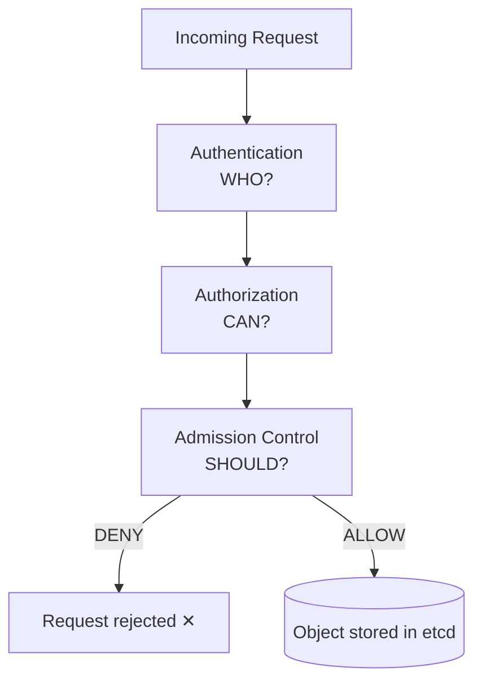
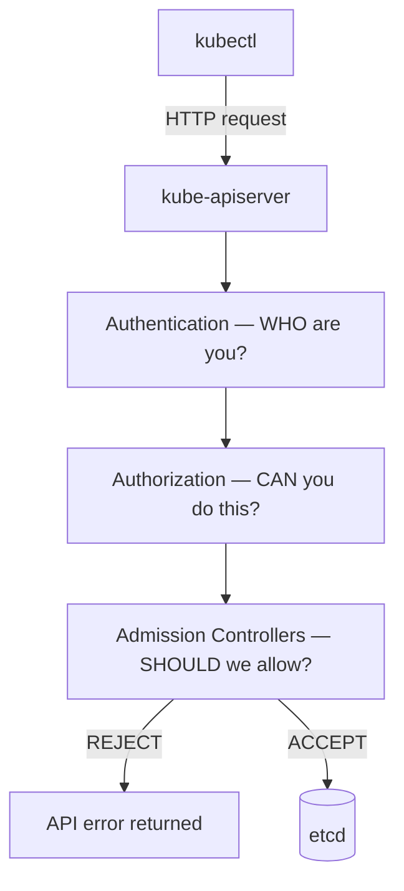
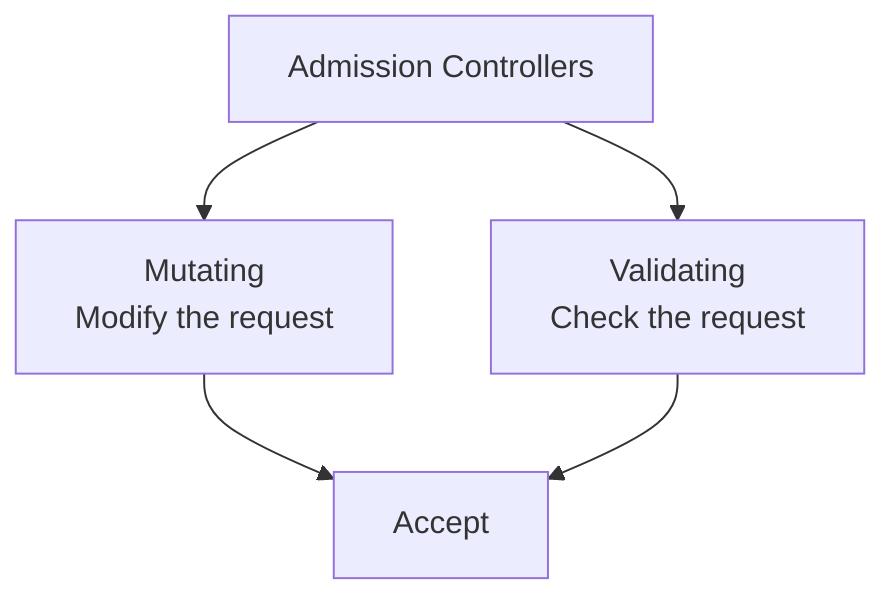
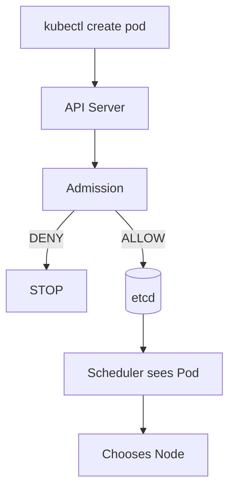
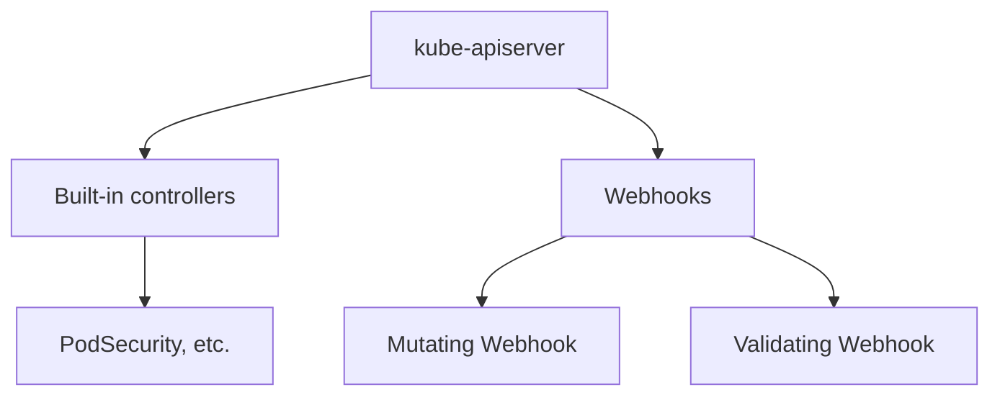
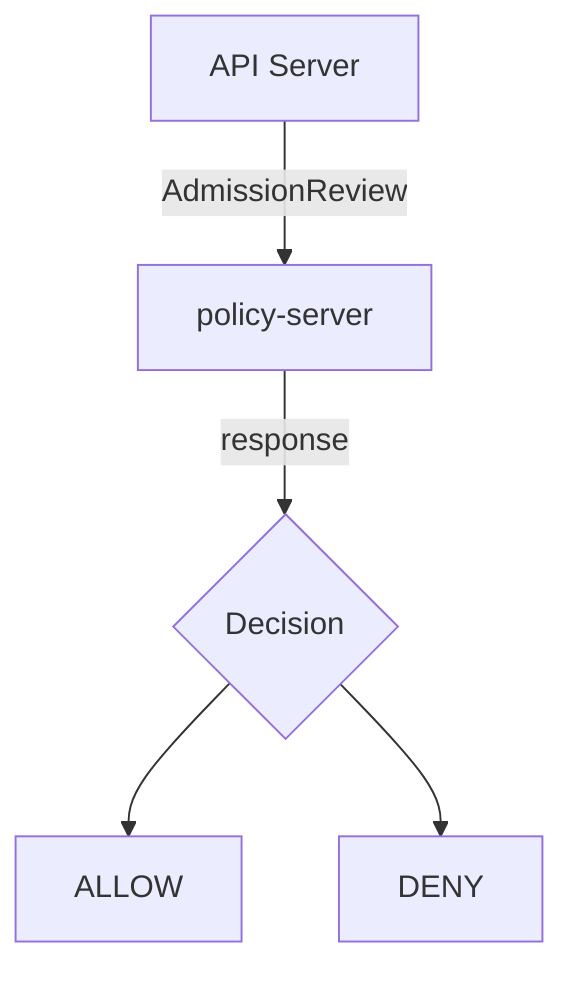
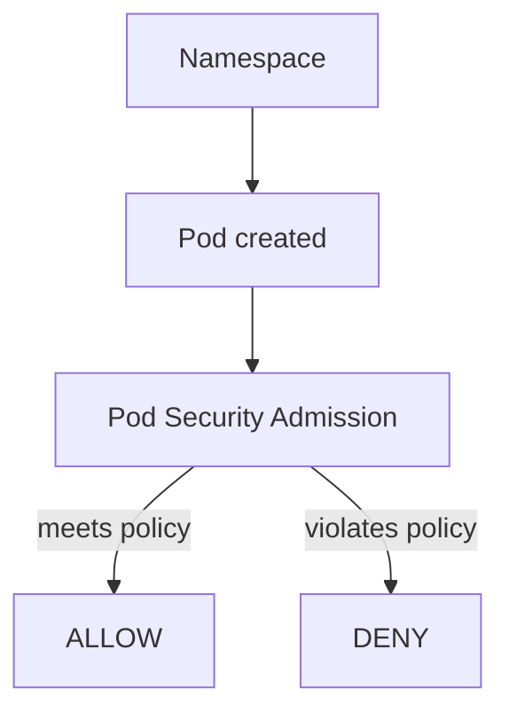

# Kubernetes Admission Controllers

> **One sentence to remember:** Admission Controllers are the policy gatekeepers of the Kubernetes API — they inspect API requests *after* authorization and *before* persistence, and can **modify** or **reject** them.

A practical guide to understanding what admission controllers are, why they exist, the two major types, how they differ from RBAC and the scheduler, and how to inspect, enable, and disable them.

---

## Table of Contents

1. [The Mental Model](#1-the-mental-model)
2. [The Full API Request Journey](#2-the-full-api-request-journey)
3. [Why Do We Need Admission Controllers?](#3-why-do-we-need-admission-controllers)
4. [What Exactly Is an Admission Controller?](#4-what-exactly-is-an-admission-controller)
5. [The Two Major Types](#5-the-two-major-types)
6. [Built-in Admission Controllers](#6-built-in-admission-controllers)
7. [A Real Example: Requiring Resource Limits](#7-a-real-example-requiring-resource-limits)
8. [Admission Controller vs Scheduler](#8-admission-controller-vs-scheduler)
9. [Admission Controller vs RBAC](#9-admission-controller-vs-rbac)
10. [Where Admission Controllers Run](#10-where-admission-controllers-run)
11. [Admission Webhooks](#11-admission-webhooks)
12. [Pod Security Admission](#12-pod-security-admission)
13. [Inspecting Admission Controllers](#13-inspecting-admission-controllers)
14. [Enabling & Disabling Admission Controllers](#14-enabling--disabling-admission-controllers)
15. [Quick Reference](#15-quick-reference)

---

## 1. The Mental Model

Every Kubernetes API request passes through a series of security checkpoints. The simplest way to remember them:

| Stage | Question it answers |
| --- | --- |
| **Authentication** | **WHO** are you? |
| **Authorization** | **CAN** you do this? |
| **Admission** | **SHOULD** we allow this? |



Authentication and authorization decide *whether you are allowed to act*. Admission decides *whether the specific thing you are trying to do satisfies cluster policy*.

---

## 2. The Full API Request Journey

When a developer runs:

```bash
kubectl apply -f pod.yaml
```

the request flows through the API server like this:



Admission control is the last gate before the object is persisted to `etcd`.

---

## 3. Why Do We Need Admission Controllers?

Suppose a developer submits a simple Pod:

```yaml
apiVersion: v1
kind: Pod
metadata:
  name: nginx
spec:
  containers:
    - name: nginx
      image: nginx
```

- **Authentication** asks: *Who are you?*
- **Authorization** asks: *Are you allowed to create Pods?*

But there is a third question the cluster often needs to ask:

> **Is this request acceptable according to our cluster policies?**

That is precisely the gap admission controllers fill. Authentication and authorization cannot express rules like *"every Pod must declare resource limits"* or *"no containers may run as root."* Admission control can.

---

## 4. What Exactly Is an Admission Controller?

An admission controller is **code that intercepts requests after authentication and authorization, but before the object is persisted** to `etcd`.

It can do one of three things:

**✅ Allow**
```text
Request → Admission → ALLOW → etcd
```

**❌ Reject**
```text
Request → Admission → DENY → API error
```

**✏️ Modify (mutate)**

Some admission controllers can actually change the request before it continues. For example, given:

```yaml
containers:
  - image: nginx
```

admission logic could automatically inject:

```yaml
securityContext:
  runAsNonRoot: true
```

So admission controllers are **not only security guards**. They act as **validators, mutators, and policy-enforcement mechanisms**.

---

## 5. The Two Major Types



### Mutating Admission Controller

Changes the object before it is stored.

**Example policy:** *"Every Pod must have the label `environment=prod`."*

The developer submits a Pod with no such label, and the mutating controller transforms it into:

```yaml
metadata:
  labels:
    environment: prod
```

The modified object then continues through the rest of admission.

### Validating Admission Controller

Checks the object and answers **YES** or **NO** — it does not change anything.

**Example policy:** *"Containers must not run as root."*

The developer submits:

```yaml
securityContext:
  runAsUser: 0
```

The validator responds:

```text
❌ DENY — Container cannot run as root
```

> **Order matters:** Mutating controllers run **first**, then validating controllers run on the (possibly modified) object.

---

## 6. Built-in Admission Controllers

Kubernetes ships with many admission controllers. Some common ones include:

- `NamespaceLifecycle`
- `LimitRanger`
- `ServiceAccount`
- `ResourceQuota`
- `DefaultStorageClass`
- `DefaultTolerationSeconds`
- `NodeRestriction`
- `PodSecurity`
- `MutatingAdmissionWebhook`
- `ValidatingAdmissionWebhook`

> The exact set enabled depends on your Kubernetes version and cluster configuration.

---

## 7. A Real Example: Requiring Resource Limits

Imagine your organization has a rule:

> **Every Pod must declare resource requests and limits.**

A developer creates:

```yaml
apiVersion: v1
kind: Pod
metadata:
  name: web
spec:
  containers:
    - name: nginx
      image: nginx
```

This Pod does not specify:

```yaml
resources:
  requests: {}
  limits: {}
```

A policy can reject it up front:

```text
❌ Pod rejected
   CPU request is required
   Memory request is required
```

This is far better than discovering the problem *after* the Pod is already running in the cluster.

---

## 8. Admission Controller vs Scheduler

A very common point of confusion.

| | Admission Controller | Scheduler |
| --- | --- | --- |
| **Question** | *Can/should this API object be accepted?* | *Which node should run this Pod?* |
| **When** | Before the object is stored | After the object is stored |



**Admission control happens before scheduling.**

---

## 9. Admission Controller vs RBAC

Another important distinction.

Suppose Alice wants to create a Pod.

- **RBAC (Authorization)** asks: *Can Alice create Pods?*
- **Admission** asks: *Is this particular Pod acceptable?*

Alice may be allowed to create Pods, but the specific Pod may violate policy (for example, it uses a forbidden image):

```text
Authentication → ALLOW
Authorization  → ALLOW
Admission      → DENY
```

| Mechanism | Controls |
| --- | --- |
| **RBAC** | **WHO** can perform an action |
| **Admission** | Whether the requested **object/action satisfies policy** |

RBAC does not understand the full contents of a Pod the way admission policies can. Admission can enforce fine-grained rules such as:

- ❌ privileged container
- ❌ `hostNetwork`
- ❌ forbidden registry
- ❌ missing labels
- ❌ missing resource limits
- ❌ running as root

---

## 10. Where Admission Controllers Run

Admission controllers are part of the **API server request path**. They come in two forms:



- **Built-in admission controllers** — implemented as part of Kubernetes itself.
- **Admission webhooks** — external/custom admission logic the API server calls out to.

---

## 11. Admission Webhooks

This is where admission becomes extremely powerful. Suppose your company runs a service called `policy-server`. The API server can send it an `AdmissionReview` request and act on the response:



The webhook can inspect the namespace, Pod, image, labels, security context, resources, user, operation, and more — then decide what happens.

### Mutating Webhook Example

**Policy:** *Every Pod must have the label `company: mycompany`.*

Developer submits:

```yaml
metadata:
  name: nginx
```

The mutating webhook rewrites it to:

```yaml
metadata:
  name: nginx
  labels:
    company: mycompany
```

The developer never had to write the label. That is **mutation**.

### Validating Webhook Example

**Policy:** *Only images from `registry.company.com` are allowed.*

Developer submits:

```yaml
containers:
  - image: docker.io/nginx
```

The validating webhook responds:

```text
❌ DENY — Image registry docker.io is not allowed.
          Use registry.company.com/*
```

That is **validation**.

---

## 12. Pod Security Admission

Modern Kubernetes includes the **Pod Security Admission** mechanism, which enforces Pod Security Standards:

| Level | Meaning |
| --- | --- |
| **Privileged** | Unrestricted — widest permissions |
| **Baseline** | Minimally restrictive — blocks known privilege escalations |
| **Restricted** | Heavily restricted — follows hardening best practices |

A namespace can be configured to require Pods to meet a particular security level:



This is one of the most practical built-in admission mechanisms to know.

---

## 13. Inspecting Admission Controllers

On a control-plane node, how you inspect admission configuration depends on how the cluster was installed.

For **kubeadm** clusters, the API server runs as a static Pod. Inspect its manifest:

```bash
cat /etc/kubernetes/manifests/kube-apiserver.yaml
```

Look for a line such as:

```text
--enable-admission-plugins=NodeRestriction
```

You can also inspect the running API server's arguments:

```bash
kubectl -n kube-system get pod kube-apiserver-<node> -o yaml
kubectl -n kube-system describe pod kube-apiserver-<node>
```

---

## 14. Enabling & Disabling Admission Controllers

### Enabling

On a kubeadm-style control plane, you may see:

```yaml
spec:
  containers:
    - command:
        - kube-apiserver
        - --enable-admission-plugins=NodeRestriction
```

To enable additional built-in plugins, add them to the flag:

```text
--enable-admission-plugins=NodeRestriction,PodSecurity
```

Changing this manifest causes the API server to restart/reconcile.

> ⚠️ **Warning:** Changing API-server admission configuration is a **control-plane operation**. A typo can make the API server unavailable.

### Disabling

There is also a disable flag:

```text
--disable-admission-plugins=SomePlugin
```

> ⚠️ **Do not randomly disable admission controllers.** Some are important for cluster security and correctness.

---

## 15. Quick Reference

**The checkpoint model**

```text
REQUEST
   │
   ▼
Authentication  → WHO?
   │
   ▼
Authorization   → CAN?
   │
   ▼
Admission       → SHOULD?
   │
   ├── DENY
   └── ALLOW → etcd
```

**Within admission**

```text
Admission
   ├── MUTATING   → change it
   └── VALIDATING → check it
          │
          ▼
       ACCEPT
```

**Key distinctions**

| Compared with | Admission controllers... |
| --- | --- |
| **RBAC** | ...check whether the *object* satisfies policy, not just *who* is acting |
| **Scheduler** | ...run *before* the object is stored; scheduling runs *after* |

---

*Admission Controllers are the policy gatekeepers of the Kubernetes API — they inspect requests after authorization and before persistence, and can modify or reject them.*
