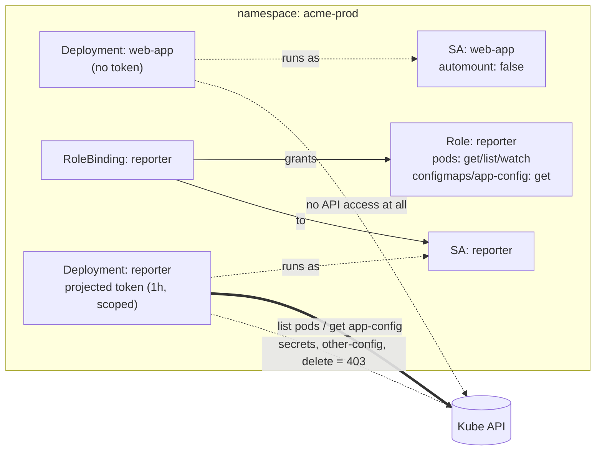

# Production-Grade Kubernetes ServiceAccount Demo

A hands-on, from-scratch demo of how to use **ServiceAccounts the way you should in production**: one identity per workload, least-privilege RBAC (down to a single named object), short-lived tokens, no token at all when one isn't needed, hardened pods, and a reference for bridging to cloud IAM.

You'll deploy two workloads into an `acme-prod` namespace and then *prove* — with real commands — that each can do exactly what it should and nothing more.

| Workload | Talks to K8s API? | Identity | What it can do |
|----------|-------------------|----------|----------------|
| `web-app` | **No** | `web-app` SA, **token not mounted** | serve traffic only |
| `reporter` | **Yes** | `reporter` SA + least-privilege Role | list pods, read **one** ConfigMap by name |

Everything else — reading Secrets, reading other ConfigMaps, listing ConfigMaps, deleting pods, touching other namespaces — is **denied**, and there are scripts that demonstrate each denial.

---

## Table of contents

1. [The mental model](#1-the-mental-model)
2. [Prerequisites](#2-prerequisites)
3. [What's in the box](#3-whats-in-the-box)
4. [Quick start](#4-quick-start)
5. [Step-by-step walkthrough (with teaching)](#5-step-by-step-walkthrough-with-teaching)
6. [Production practices this demo shows](#6-production-practices-this-demo-shows)
7. [Bridging to cloud IAM](#7-bridging-to-cloud-iam)
8. [Cleanup](#8-cleanup)
9. [Troubleshooting](#9-troubleshooting)

---

## 1. The mental model

Three objects, three jobs:

- **ServiceAccount** — *who a pod is.* Every pod runs as one; if you don't pick, it uses `default`.
- **Role** (or **ClusterRole**) — *what may be done* (verbs like `get`, `list`, `create` on resources like `pods`, `configmaps`).
- **RoleBinding** (or **ClusterRoleBinding**) — *the glue* that grants a Role to a ServiceAccount.



Two rules do most of the work in production:

1. **If a pod doesn't call the API, don't give it a token** (`automountServiceAccountToken: false`).
2. **If it does, grant the narrowest Role that lets it work** — and prefer the auto-issued, short-lived, bound token over long-lived Secret tokens.

---

## 2. Prerequisites

- A Kubernetes cluster (**v1.24+** recommended, so bound tokens and Pod Security Admission are available). `kind`, `minikube`, `k3s`, Docker Desktop, or any managed cluster all work.
- `kubectl` configured for it — check with `kubectl get nodes`.

No cluster yet?

```bash
kind create cluster        # or: minikube start
```

---

## 3. What's in the box

```
production-serviceaccount-demo/
├── README.md
├── manifests/                       # applied in filename order
│   ├── 00-namespace.yml             # namespace + Pod Security "restricted"
│   ├── 10-app-serviceaccount.yml    # web-app SA, automount OFF
│   ├── 11-app-deployment.yml        # web-app, hardened, no token
│   ├── 20-reporter-serviceaccount.yml
│   ├── 21-reporter-role.yml         # least-privilege Role (name-scoped)
│   ├── 22-reporter-rolebinding.yml
│   ├── 23-configmaps.yml            # app-config (allowed) + other-config (denied)
│   ├── 24-app-secret.yml            # exists only to prove a denial
│   └── 25-reporter-deployment.yml   # reporter, explicit projected token
├── reference/
│   └── cloud-iam-serviceaccounts.yml  # EKS/GKE/AKS patterns (do NOT apply locally)
└── scripts/
    ├── 01-setup.sh                  # apply + wait for rollout
    ├── 02-verify.sh                 # prove what each identity CAN do
    ├── 03-negative-tests.sh         # prove what the reporter is DENIED
    └── 99-cleanup.sh                # delete the namespace
```

---

## 4. Quick start

```bash
chmod +x scripts/*.sh

./scripts/01-setup.sh            # deploy everything
kubectl -n acme-prod logs deploy/reporter -f   # watch it work (Ctrl-C to stop)

./scripts/02-verify.sh           # positive checks
./scripts/03-negative-tests.sh   # denial checks (Forbidden == PASS)

./scripts/99-cleanup.sh          # tear down
```

The rest of this README explains *why* each piece looks the way it does.

---

## 5. Step-by-step walkthrough (with teaching)

### Step 1 — Create the namespace with Pod Security enforced

```bash
kubectl apply -f manifests/00-namespace.yml
```

The namespace carries `pod-security.kubernetes.io/enforce: restricted`. That switches on **Pod Security Admission**: the API server will *reject* any pod in this namespace that runs as root, keeps Linux capabilities, or allows privilege escalation. It's a safety net that forces every workload below to be hardened. Try loosening a `securityContext` later and watch the pod get refused — that's PSA doing its job.

### Step 2 — An identity for a workload that needs no API access

```bash
kubectl apply -f manifests/10-app-serviceaccount.yml
kubectl apply -f manifests/11-app-deployment.yml
```

`web-app` is a plain web server. It never calls the Kubernetes API, so the ServiceAccount sets:

```yaml
automountServiceAccountToken: false
```

**Why this matters:** most application pods have no business holding an API credential. If such a pod is compromised, an attacker with a token can start poking the API. No token, no lever. This is the single most common quick win in a real cluster — audit your app pods and turn auto-mount off wherever it isn't needed.

Prove it after rollout:

```bash
kubectl -n acme-prod exec deploy/web-app -- ls /var/run/secrets/kubernetes.io/serviceaccount
# -> "No such file or directory"  (there is no token to steal)
```

### Step 3 — A least-privilege Role for the workload that *does* need access

```bash
kubectl apply -f manifests/20-reporter-serviceaccount.yml
kubectl apply -f manifests/21-reporter-role.yml
kubectl apply -f manifests/22-reporter-rolebinding.yml
kubectl apply -f manifests/23-configmaps.yml
kubectl apply -f manifests/24-app-secret.yml
```

The `reporter` Role grants only:

```yaml
- resources: ["pods"]
  verbs: ["get", "list", "watch"]          # read-only
- resources: ["configmaps"]
  resourceNames: ["app-config"]            # ONE named object
  verbs: ["get"]
```

Two production techniques here:

- **Read-only verbs.** No `create`, `update`, or `delete`. If the workload only reports, it can't mutate anything.
- **`resourceNames`.** Access is pinned to a single ConfigMap. The reporter can read `app-config` and *nothing else* — not `other-config`, not any Secret.

> **Gotcha (real and worth remembering):** `resourceNames` only works with verbs that address one object — `get`, `update`, `patch`, `delete`. It does **not** work with `list` or `watch`. You cannot "list only these names" through RBAC. That's why the Role grants `get` on the ConfigMap, and the reporter fetches it *by name* rather than listing.

### Step 4 — Give the reporter an explicit, short-lived token

```bash
kubectl apply -f manifests/25-reporter-deployment.yml
kubectl -n acme-prod rollout status deploy/reporter
```

Rather than the legacy auto-mounted token, the reporter builds its credential with a **projected volume**:

```yaml
- serviceAccountToken:
    expirationSeconds: 3600                 # rotated before it expires
    audience: https://kubernetes.default.svc
```

**Why this matters:** old-style tokens were stored in a Secret and never expired — a leaked one was valid forever. Bound tokens (default since Kubernetes 1.24) **expire and are auto-rotated**, and can be **scoped to an audience** so a token minted for the API server isn't accepted by some other service. Here we set these explicitly to make the behavior visible; in most workloads the default auto-mounted token already gives you this for free.

Watch the reporter use its access:

```bash
kubectl -n acme-prod logs deploy/reporter -f
```

You'll see it list pods and print `app-config` every 30 seconds.

### Step 5 — Verify allowed access

```bash
./scripts/02-verify.sh
```

This uses `kubectl auth can-i --as=...` to ask the API server directly, no pods required:

```bash
kubectl auth can-i list pods                    --as=system:serviceaccount:acme-prod:reporter -n acme-prod   # yes
kubectl auth can-i get configmaps/app-config    --as=system:serviceaccount:acme-prod:reporter -n acme-prod   # yes
kubectl auth can-i get secrets                  --as=system:serviceaccount:acme-prod:reporter -n acme-prod   # no
```

`kubectl auth can-i` is your everyday tool for reasoning about RBAC without deploying anything.

### Step 6 — Verify the denials (the important half)

```bash
./scripts/03-negative-tests.sh
```

From inside the reporter pod, each of these fails with `Forbidden` — which the script reports as **PASS**:

| Attempt | Why it's denied |
|---------|-----------------|
| read `app-secret` | no `secrets` permission at all |
| read `other-config` | `resourceNames` allows only `app-config` |
| `list configmaps` | only `get`-by-name was granted, not `list` |
| delete a pod | Role is read-only |
| read pods in `kube-system` | Role is namespaced to `acme-prod` |

A typical denial looks like:

```
Error from server (Forbidden): secrets "app-secret" is forbidden:
User "system:serviceaccount:acme-prod:reporter" cannot get resource "secrets"
in API group "" in the namespace "acme-prod"
```

Seeing the least-privilege boundary hold is the whole point of the demo.

---

## 6. Production practices this demo shows

- **One ServiceAccount per workload.** Never share, never reuse `default`. Distinct identities make audit logs and blast-radius analysis meaningful.
- **Least privilege, including object-level scoping** via `resourceNames`.
- **No token unless needed** (`automountServiceAccountToken: false`), applied at both the ServiceAccount and the pod for defense in depth.
- **Short-lived, audience-scoped tokens** via a projected `serviceAccountToken` volume.
- **Namespace-scoped RBAC** (`Role`/`RoleBinding`) instead of cluster-wide, unless cluster reach is truly required.
- **Hardened pods** that satisfy Pod Security "restricted": non-root, no privilege escalation, all capabilities dropped, `RuntimeDefault` seccomp, read-only root filesystem, resource limits.
- **Everything in its own namespace** with recommended `app.kubernetes.io/*` labels, so teardown and ownership are clean.

What to add for a real cluster: audit RBAC regularly (`kubectl auth can-i --list`), consider tools like `rbac-lookup`/`kubectl-who-can`, and layer NetworkPolicies on top so identity and network controls reinforce each other.

---

## 7. Bridging to cloud IAM

On managed Kubernetes you usually don't keep cloud keys in the cluster. You link a Kubernetes ServiceAccount to a cloud identity, and pods get short-lived cloud credentials automatically. See `reference/cloud-iam-serviceaccounts.yml` for the annotation on each platform:

- **AWS EKS — IRSA:** `eks.amazonaws.com/role-arn`
- **Google GKE — Workload Identity:** `iam.gke.io/gcp-service-account`
- **Azure AKS — Workload Identity:** `azure.workload.identity/client-id`

That file is **reference only** — each pattern needs matching setup on the cloud side (an IAM role/managed identity plus a trust/federation relationship), so don't `kubectl apply` it on a local cluster.

---

## 8. Cleanup

```bash
./scripts/99-cleanup.sh
# equivalently:
kubectl delete namespace acme-prod
```

Deleting the namespace removes every object created here.

---

## 9. Troubleshooting

| Symptom | Cause / fix |
|---------|-------------|
| Pod rejected: `violates PodSecurity "restricted"` | A `securityContext` field was removed or weakened. Restore non-root / drop-ALL / seccomp / `allowPrivilegeEscalation: false`. |
| `reporter` `CrashLoopBackOff` or image pull error | The pinned `alpine/kubectl:1.31.0` tag isn't on your registry. Swap it in `manifests/25-*.yml` for any kubectl image, e.g. `bitnami/kubectl:1.31`, `rancher/kubectl:v1.31.0`. |
| `web-app` not Ready | Under a read-only root fs nginx needs the scratch volumes; they're already mounted. Check events: `kubectl -n acme-prod describe pod -l app.kubernetes.io/name=web-app`. |
| reporter logs show `Unable to connect / forbidden` for pods | RoleBinding didn't apply, or the pod isn't using the `reporter` SA. Check `kubectl -n acme-prod get pod -l app.kubernetes.io/name=reporter -o jsonpath='{.items[0].spec.serviceAccountName}'`. |
| `configmap "kube-root-ca.crt" not found` on the projected volume | Rare on very old clusters. It's auto-created per namespace on v1.20+. Upgrade, or drop the `configMap` source and let the default token handle the CA. |
| `auth can-i` says `no` for something you expected `yes` | Re-read the Role — remember `resourceNames` doesn't apply to `list`/`watch`, and Roles are per-namespace. |

---

### One-line takeaway

*Give every workload its own identity, mount a credential only when it's needed, scope that credential to the smallest possible set of actions — and then prove it.*
