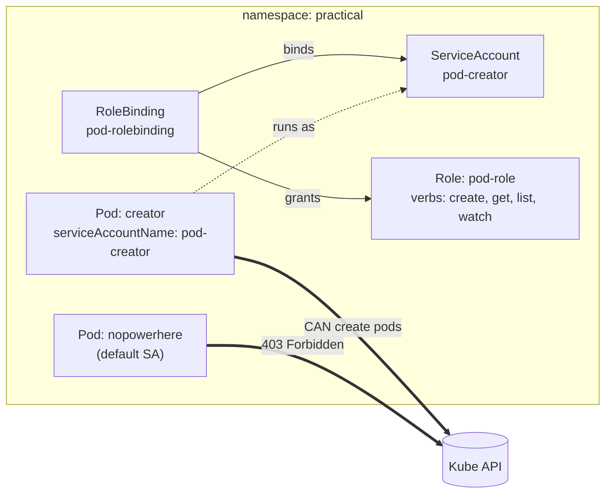

# Kubernetes RBAC + ServiceAccount Demo

A tiny, self-contained demo that shows how **pods authenticate to the Kubernetes API using a ServiceAccount**, and how **RBAC decides what they're allowed to do**.

Two pods are created in a `practical` namespace. Both run the same `bitnami/kubectl` image, but:

| Pod | ServiceAccount | Result |
|-----|----------------|--------|
| `creator` | `pod-creator` (bound to a Role) | ✅ can create/list pods |
| `nopowerhere` | `default` (no Role bound) | ❌ everything is `403 Forbidden` |

The difference between "can" and "can't" is **one line of YAML** (`serviceAccountName`) plus a Role and a RoleBinding.

---

## How it works

Every pod is given a mounted ServiceAccount token. When the `kubectl` inside a pod talks to the API server, it authenticates as `system:serviceaccount:<namespace>:<sa-name>`. What that identity may do is the union of all Roles bound to it. No binding → no permissions.



---

## Prerequisites

- A running Kubernetes cluster (`kind`, `minikube`, `k3s`, Docker Desktop, EKS/GKE/AKS — any will do)
- `kubectl` configured to talk to it (`kubectl get nodes` should work)

> No cluster handy? Spin one up in seconds:
> ```bash
> kind create cluster        # or: minikube start
> ```

---

## Files

```
rbac-serviceaccount-demo/
├── README.md
├── demo.sh                     # applies everything + runs the 3 tests
├── cleanup.sh                  # deletes the namespace (and all of the above)
└── manifests/
    ├── 00-namespace.yml        # namespace: practical
    ├── 01-serviceaccount.yml   # SA: pod-creator
    ├── 02-role.yml             # Role: pod-role (create/get/list/watch pods)
    ├── 03-rolebinding.yml      # binds pod-role -> pod-creator
    ├── 04-creator-pod.yml      # pod that uses pod-creator (empowered)
    └── 05-noaccess-pod.yml     # pod that uses default SA (powerless)
```

Files are numbered so `kubectl apply -f manifests/` creates them in dependency order.

---

## Quick start

```bash
chmod +x demo.sh cleanup.sh
./demo.sh
```

The script applies the manifests, waits for the pods, and runs three tests with clear PASS/FAIL output. When you're done:

```bash
./cleanup.sh
```

---

## Manual walkthrough

Prefer to type it out yourself? Here's the whole thing by hand.

**1. Apply the manifests**

```bash
kubectl apply -f manifests/
kubectl -n practical wait --for=condition=Ready pod/creator pod/nopowerhere --timeout=120s
```

**2. The empowered pod creates a pod → succeeds**

```bash
kubectl -n practical exec -i creator -- kubectl apply -f - <<'EOF'
apiVersion: v1
kind: Pod
metadata:
  name: created-by-serviceaccount
  namespace: practical
spec:
  containers:
    - name: nginx
      image: nginx
EOF
```

Expected:

```
pod/created-by-serviceaccount created
```

**3. The same pod tries to delete → forbidden**

The Role grants `create/get/list/watch` but not `delete`, so:

```bash
kubectl -n practical exec creator -- kubectl delete pod created-by-serviceaccount
```

Expected:

```
Error from server (Forbidden): pods "created-by-serviceaccount" is forbidden:
User "system:serviceaccount:practical:pod-creator" cannot delete resource "pods"
in API group "" in the namespace "practical"
```

**4. The powerless pod tries to list → forbidden**

```bash
kubectl -n practical exec nopowerhere -- kubectl get pods
```

Expected:

```
Error from server (Forbidden): pods is forbidden:
User "system:serviceaccount:practical:default" cannot list resource "pods"
in API group "" in the namespace "practical"
```

That's the whole lesson: same image, same commands — the **identity** is what changes the outcome.

---

## Things to try next

- **Grant delete:** add `"delete"` to the `verbs` list in `02-role.yml`, re-apply, and watch step 3 start passing.
- **Empower the second pod:** set `serviceAccountName: pod-creator` in `05-noaccess-pod.yml` and see step 4 succeed.
- **Cross-namespace:** try to create a pod in a *different* namespace from `creator` — it fails, because a `Role`/`RoleBinding` is namespace-scoped. (Use a `ClusterRole` + `ClusterRoleBinding` for cluster-wide access.)
- **Check permissions without exec-ing:**
  ```bash
  kubectl auth can-i create pods \
    --namespace practical \
    --as system:serviceaccount:practical:pod-creator      # -> yes
  kubectl auth can-i create pods \
    --namespace practical \
    --as system:serviceaccount:practical:default          # -> no
  ```

---

## Troubleshooting

| Symptom | Likely cause / fix |
|---------|--------------------|
| `pod/creator` never becomes Ready | Image pull is slow or blocked; `kubectl -n practical describe pod creator` to see events. |
| `error: unable to upgrade connection` on `exec` | The pod isn't Ready yet, or your kubeconfig lacks exec rights. Wait, then retry. |
| Test 1 unexpectedly fails with Forbidden | The RoleBinding didn't apply, or the pod isn't using `pod-creator`. Check `kubectl -n practical get pod creator -o jsonpath='{.spec.serviceAccountName}'`. |
| Everything works but you can't clean up | `kubectl delete ns practical` directly; namespace deletion is the catch-all. |

---

## Key takeaways

- A **ServiceAccount** is *who* a pod is; a **Role** is *what may be done*; a **RoleBinding** connects the two.
- No RoleBinding means no permissions — the `default` ServiceAccount is intentionally powerless.
- RBAC is **allow-list only**: if a verb isn't listed, it's denied.
- `Role`/`RoleBinding` are namespace-scoped; use `ClusterRole`/`ClusterRoleBinding` for cluster-wide rules.
